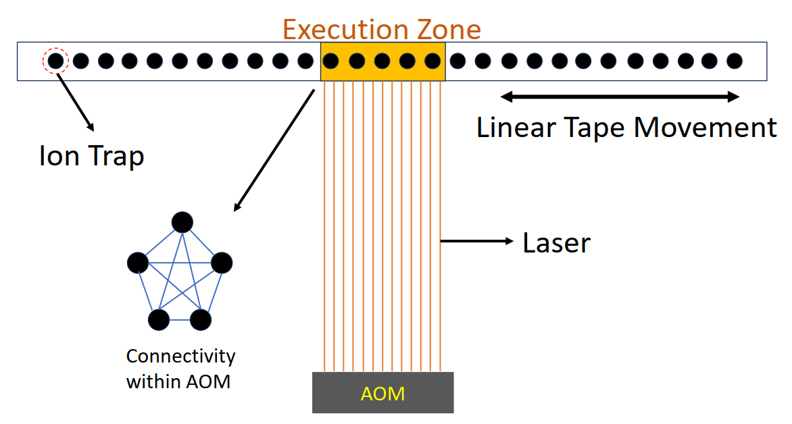
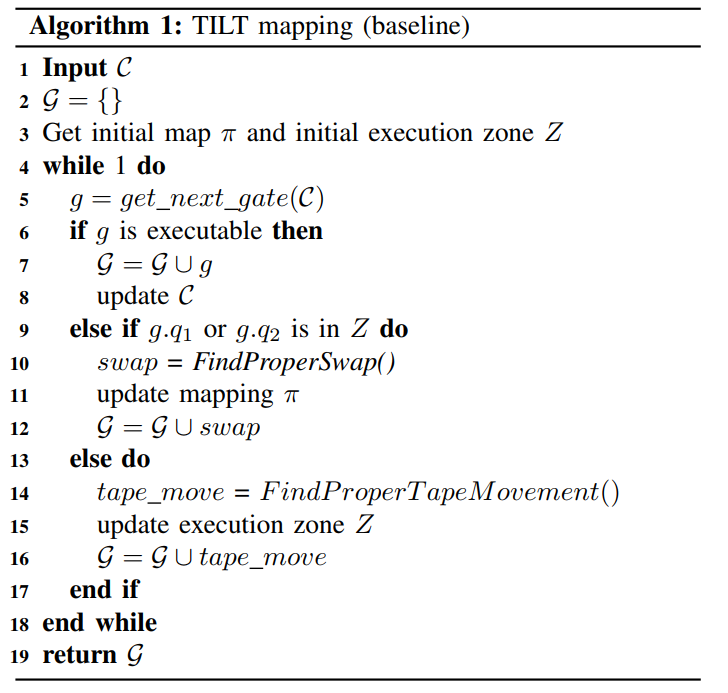
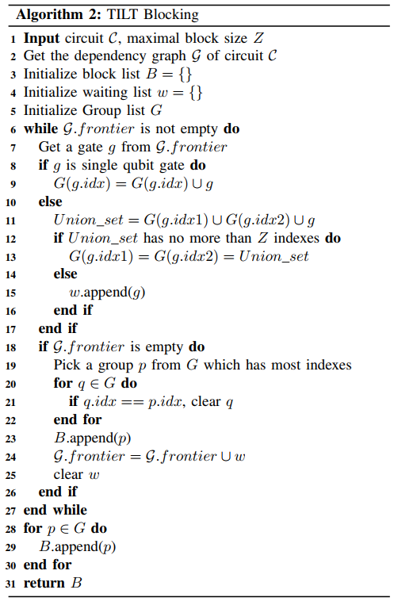
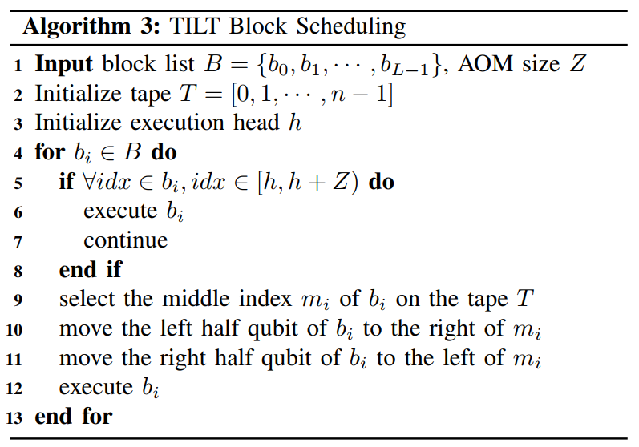
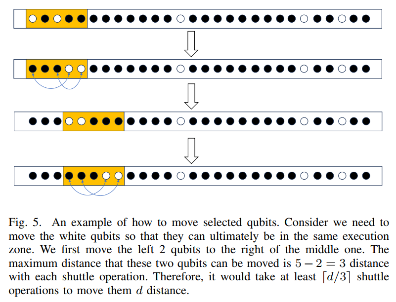

## 论文 《BOSS꞉ Blocking algorithm for optimizing shuttling scheduling in Ion Trap》 阅读笔记

### 前置知识

基于离子阱的结构，量子是按线性排布的：

 

 黑色点代表量子，激光每次只能作用上相邻的若干量子，使这些量子进行门操作。

因此，要作用到激光范围外的量子，要么移动量子条带，要么移动激光发射器，目前一般采用移动量子条带的方案。因为：

- 移动激光发射器意味着一大堆超高稳定光学平台、镜子、透镜、光纤头、镜架都要跟着移动，每条光路都要保持几微米级对准，工程难度太高了。
- 如果不移动激光发射器，改为使用光学器件改变激光光路，论文说到，这种方法角度调节范围有限，且随着离子阱中量子比特数量的增加，要实现全局控制将变得不切实际。

但是移动量子条带也有缺点：

- 移动量子条带的方式：通过改变电极电压，把离子在离子阱芯片上来回移动。
- 搬运不可避免地给离子振动加热，而两比特门高度依赖振动模式保持冷静和可控。振动越热，门做得越不精确，误差就越大。即使间歇冷却也弥补不完，所以要在架构设计和调度策略上尽量少搬家。

论文中将这种“搬家”称为 **穿梭操作**(Shuttling operations)。

补充概念：

**AOM**：Acousto-Optic Modulator（声光调制器）：相当于若干条激光控制通道的开关板，决定了能够一次性并行操作的量子数。
**AOD**：Acousto-Optic Deflector（声光偏转器）：改变激光出射光的方向

### 前人研究

前人研究通过减少因穿梭操作引起的SWAP门数量，从而最大化保真度：若某个门作用的两个量子比特间距离超过设定值，则利用启发式函数寻找最佳位置，以插入额外的SWAP门。缺点：

- 启发式函数需要计算所有剩余的门，非常耗时。
- 逐个处理每个门，而忽略了整个电路的全局信息，可能会导致更多的穿梭操作。

### Algorithm 1

算法 1 不是论文的算法，而是一份基础的、没有任何优化的算法，用于凸显论文算法优势。

(我觉得上面这个算法1伪代码有问题，写得很不清楚，一旦进入if的第二个分支会进入死循环。论文完全没讲 `FindProperSwap()` 和 `FindProperTapeMovement()`。而且，谁用 $\pi$ 做映射的标记符号啊，真的很容易被误解的好吧)

算法流程：

（假设所有的量子门都是单比特或双比特门，下面是我自己的理解）

从头到尾遍历所有的量子门，每遍历到一个量子门：

- 如果该门的作用量子都在激光作用范围内，则直接执行该门。
- 如果该门有一个量子不在激光作用范围内，则调用 `FindProperSwap()`，使用启发式函数寻找最佳位置插入额外的SWAP门，这个SWAP门在激光范围内。然后(1)执行SWAP，(2)移动移动量子条带。反复执行这两步，直到该门的作用量子都在激光作用范围内。
- 如果该门有两个量子不在激光作用范围内，则调用 `FindProperTapeMovement()`，使用启发式函数移动量子条带。

### Algorithm 2

这个是论文的核心算法，作用是将量子电路进行分块，每一块包含的量子数量不超过激光最多可覆盖的量子数量。

算法首先构造出所有量子门执行顺序的依赖图。比如先执行门A，才能执行门B，那么就在图中画一条从A指向B的边。

`frontier` 代表当前没有前驱、可直接执行的门集合。

每个量子比特都维护一个量子门集合 $G(g.idx)$

按广搜BFS的方式：

1. 取 `frontier` 中的一个门 $g$
2. 如果 $g$ 是单比特门，则直接加入这个量子比特对应的量子门集合 $G(g.idx)$。
3. 如果 $g$ 是双比特门，则 $Union\_set=G(g.idx) \cup G(g.jdx) \cup {g}$，即把 $g$ 的两个量子比特对应的量子门集合和 $g$ 合并。
   - 如果这个 union 涉及的比特数量大于可激光最多可覆盖的量子数量，那么就先将这个门放入等待队列。
   - 如果没超过激光最多可覆盖的量子数量，那么这两个 group 都更新为 Union_set。
4. 如果这轮处理完 frontier 变空了：
   - 从所有 $G(g.idx)$ 中取覆盖量子数量最多的放入 block 列表 $B$，清空 $G(g.idx)$。
   - 再将等待队列中的所有门放回 `frontier` 中，清空等待队列。
5. 重复步骤 1-4，直到 `frontier` 为空为止。
6. 主循环结束后，group 里可能还有一些残留的 group（最后一批没触发“frontier 为空”的分 block 逻辑），把它们也都 append 到 $B$。
7. 返回 block 列表 $B$。

### Alogorithm 3

这个算法的作用是，确定了一个 Block 中各个量子的 id 之后，如何将这些量子高效地 SWAP 到一起。

简单粗暴，看这个图就懂了：

