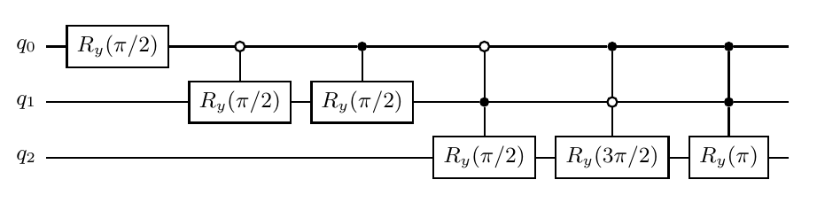
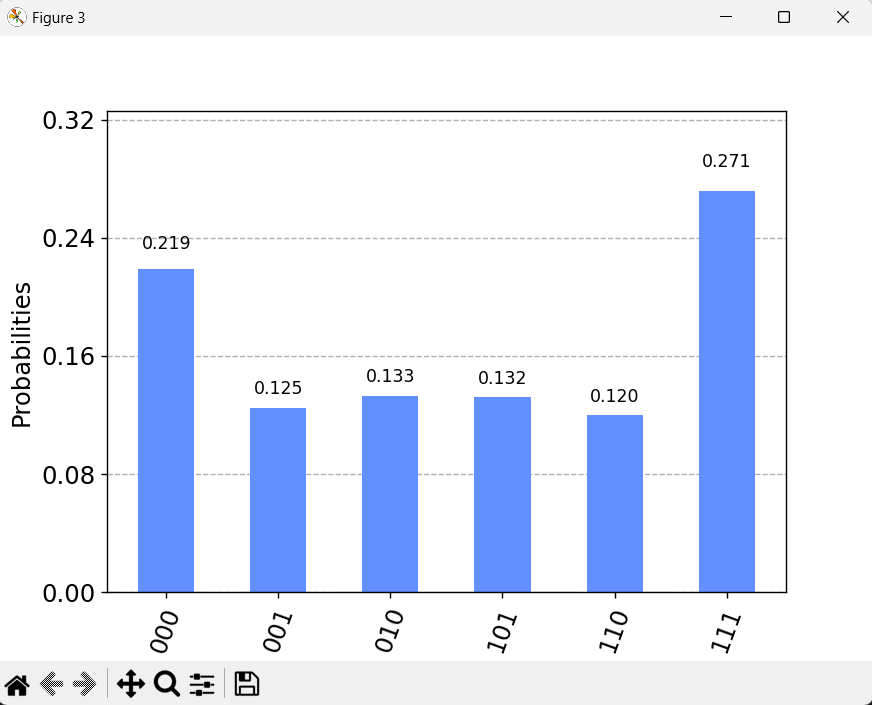
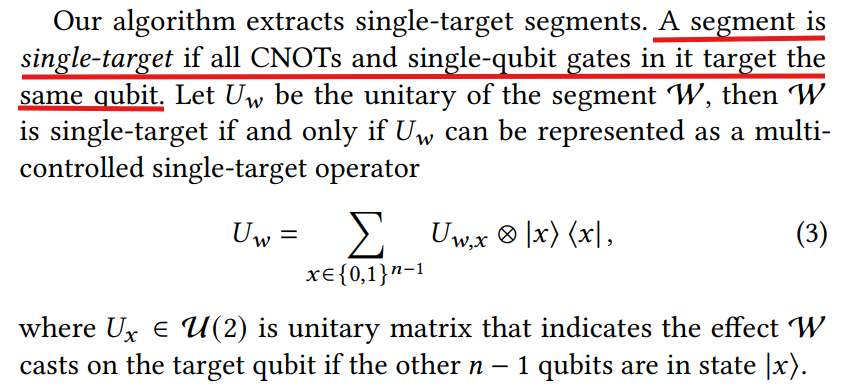
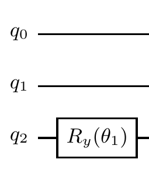
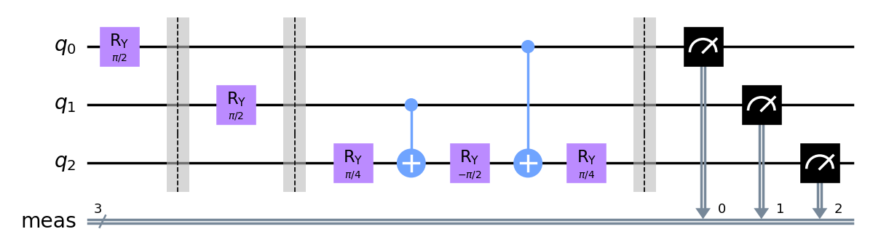
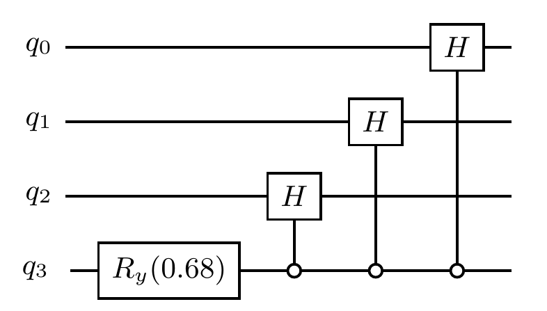

## 论文 Quantum State Preparation Circuit Optimization Exploiting Don't Cares（利用无关项进行量子态制备线路的优化）阅读笔记

https://doi.org/10.48550/arXiv.2409.01418

### 1 前置知识

#### 1.1 Ry 门：

$$
\begin{pmatrix}
cos(\frac{\theta}{2}) & -sin(\frac{\theta}{2}) \\
sin(\frac{\theta}{2}) & cos(\frac{\theta}{2})
\end{pmatrix}
$$

这个形式和我们之前学过的旋转矩阵很像：

$$
\begin{pmatrix}
cos \theta & -sin \theta \\
sin \theta & cos \theta
\end{pmatrix}
$$

补充这个矩阵的推导过程：

设 $OA=OB=1$，点 $A$ 围绕点 $O$ 旋转 $\theta$ 度到达点 $B$。

<div style="text-align: center;">
    
</div>

$$
X_A = cos \phi \\
Y_A = sin \phi \\
X_B = cos (\phi + \theta) = cos \phi cos \theta - sin \phi sin \theta = X_A cos \theta - Y_A sin \theta \\
Y_B = sin (\phi + \theta) = sin \phi cos \theta + cos \phi sin \theta = X_A sin \theta + Y_A cos \theta \\
$$

可以写成矩阵形式：

$$
\begin{pmatrix}
X_B \\
Y_B
\end{pmatrix} = \begin{pmatrix}
cos \theta & -sin \theta \\
sin \theta & cos \theta
\end{pmatrix} \begin{pmatrix}
X_A \\
Y_A
\end{pmatrix}
$$

再看 $R$ 门的矩阵形式，只是用 $\theta/2$ 代替 $\theta$。回想起之前布洛赫球的定义过程，也是用 $\theta/2$ 代替 $\theta$（$\ket{1}$不在 $xOy$ 平面上，而是在 $-z$ 轴上）。

因此，对某个量子 $\ket{\psi}$ 作用上 $Ry(\theta)$，相当于在布洛赫球上绕着 $y$ 轴旋转 $\theta$ 度。

如图所示，取 $xOz$ 平面，$y$ 轴的方向指向纸面外，作用 $Ry(\theta)$ 相当于在这个布洛赫球上逆时针旋转 $\theta$ 度。

<div style="text-align: center;">
    
</div>

$Ry$ 门还存在如下性质（待会要用到）：

$$
\sigma_x R_y(\theta) \sigma_x = \begin{pmatrix}
0 & 1 \\
1 & 0
\end{pmatrix} \begin{pmatrix}
cos (\theta/2) & -sin (\theta/2) \\
sin (\theta/2) & cos (\theta/2)
\end{pmatrix} \begin{pmatrix}
0 & 1 \\
1 & 0
\end{pmatrix} = \begin{pmatrix}
cos (\theta/2) & sin (\theta/2) \\
-sin (\theta/2) & cos (\theta/2)
\end{pmatrix} = R_y(-\theta)
$$


#### 1.2 多控量子门的分解方案：

目前来说，在物理电路上无法直接应用多控量子门，因此要将其分解成更加基本的量子门。我们的思路是，将多控 $Ry$ 门分解成 $CNOT$ 门和单 $Ry$ 门。

参考 https://doi.org/10.1103/PhysRevLett.93.130502：

<div style="text-align: center;">
    
</div>

假设我们有这样的一个三维多控量子门，对于控制位的每一个量子态，都有对应的一个旋转操作。

<div style="text-align: center;">
    
</div>

我们可以使用格雷码来构造分解电路，即下一个格雷码和前一个格雷码不同的位表示 CNOT 门的控制位。

可以看到，每个控制量子位都连接了偶数个 $CNOT$ 门，这样每两个 $CNOT$ 门之间的 $R_y$ 门就可以应用这个公式：

$$
\sigma_x R_y(\theta) \sigma_x = \begin{pmatrix}
0 & 1 \\
1 & 0
\end{pmatrix} \begin{pmatrix}
cos (\theta/2) & -sin (\theta/2) \\
sin (\theta/2) & cos (\theta/2)
\end{pmatrix} \begin{pmatrix}
0 & 1 \\
1 & 0
\end{pmatrix} = \begin{pmatrix}
cos (\theta/2) & sin (\theta/2) \\
-sin (\theta/2) & cos (\theta/2)
\end{pmatrix} = R_y(-\theta)
$$

即两个 $CNOT$ 门中间的旋转角度取负号。

举个更简单的例子：

将

<div style="text-align: center;">
    
</div>

分解为：

<div style="text-align: center;">
    
</div>

假设这里 $\alpha_1=0$，$\alpha_2=\frac{\pi}{2}$，$\alpha_3=\frac{3\pi}{2}$， $\alpha_4=\pi$，那么通过解线性方程组来求出 $\theta_1$，$\theta_2$，$\theta_3$，$\theta_4$。

先列出如下表格，如果角度在两个 $CNOT$ 之间，则角度取负号。

| $q_0$ | $+$ | $-$ | $-$ | $+$ |
| ------ | ------ | -------- | -------- | ------ |
| $q_1$ | $+$ | $+$ | $-$ | $-$ |

然后我们便能够得到如下线性方程组：

$$
\begin{pmatrix}
1 & 1 & 1 & 1 \\
1 & 1 & -1 & -1 \\
1 & -1 & -1 & 1 \\
1 & -1 & 1 & -1
\end{pmatrix} \begin{pmatrix}
\theta_1 \\
\theta_2 \\
\theta_3 \\
\theta_4
\end{pmatrix} = \begin{pmatrix}
\alpha_1 \\
\alpha_2 \\
\alpha_3 \\
\alpha_4
\end{pmatrix}
$$

即

$$
\begin{pmatrix}
1 & 1 & 1 & 1 \\[3pt]
1 & 1 & -1 & -1 \\[3pt]
1 & -1 & -1 & 1 \\[3pt]
1 & -1 & 1 & -1
\end{pmatrix} \begin{pmatrix}
\theta_1 \\[3pt]
\theta_2 \\[3pt]
\theta_3 \\[3pt]
\theta_4
\end{pmatrix} = \begin{pmatrix}
0 \\[3pt]
\frac{\pi}{2} \\[3pt]
\frac{3\pi}{2} \\[3pt]
\pi
\end{pmatrix}
$$

从而解得：

$
\begin{cases}
    \large \theta_1 = \frac{3\pi}{4} \\[5pt]
    \large \theta_2 = -\frac{\pi}{2} \\[5pt]
    \large \theta_3 = -\frac{\pi}{4} \\[5pt]
    \large \theta_4 = 0
\end{cases}
$

因此可以将原先的线路分解为：

<div style="text-align: center;">
    
</div>

#### 1.3 任意量子态制备方案

参考 https://doi.org/10.1038/s41598-021-85474-1

采用分而治之的方法。假设我们的初态是 $\ket{000}$，要制备如下的量子态：

$$
\ket{\psi} = \sqrt{\frac{2}{8}}\ket{000} - \sqrt{\frac{1}{8}}\ket{100} + \sqrt{\frac{1}{8}}\ket{010} + \sqrt{\frac{1}{8}}\ket{101} + \sqrt{\frac{1}{8}}\ket{011} + \sqrt{\frac{2}{8}}\ket{111}
$$

首先考虑振幅，暂时忽略相位。

考虑第一个量子位，$\ket{0**}$ 和 $\ket{1**}$ 的振幅平方和相同，则先对第一个量子位作用上 $R_y(\pi/2)$。

考虑第二个量子位，当第一个量子位为 $\ket{0}$ 时，第二个量子位为 $\ket{0}$ 或 $\ket{1}$ 的振幅相同，当第一个量子位为 $\ket{1}$ 时，第二个量子位为 $\ket{0}$ 或 $\ket{1}$ 的振幅相同。

那么目前线路变成这样：

<div style="text-align: center;">
    
</div>

同理，再考虑第三个量子位，$\ket{00*}$ 中只有 $\ket{000}$ 态有振幅，因此不需要作用上 $R_y$ 门，$\ket{10*}$ 产生 $-\ket{100}$ 和 $\ket{101}$，振幅相同，则作用上 $R_y(3\pi/2)$。后面同理，则线路变成：

<div style="text-align: center;">
    
</div>

然后应用上 1.2 节中讲述的量子线路分解方案，得到：

<div style="text-align: center;">
    
</div>

运行结果：

<div style="text-align: center;">
    
</div>

附上 qiskit 代码（使用 qiskit 版本 0.18.2）

```python
from qiskit import QuantumCircuit, transpile
from qiskit.providers.aer.backends import QasmSimulator
from qiskit.visualization import plot_histogram
import math
import matplotlib.pyplot as plt

oracle = QuantumCircuit(3)

oracle.ry(math.pi/2, 0)
oracle.barrier()

oracle.ry(math.pi/2, 1)
oracle.barrier()

oracle.ry(3*math.pi/4, 2)
oracle.cx(0, 2)
oracle.ry(-math.pi/2, 2)
oracle.cx(1, 2)
oracle.ry(-math.pi/4, 2)
oracle.cx(0, 2)
oracle.ry(0, 2)
oracle.cx(1, 2)

oracle.measure_all()
oracle.draw(output='mpl')

Simulator = QasmSimulator()
new_cir = transpile(oracle, Simulator)

result = Simulator.run(new_cir).result()
counts = result.get_counts(0)
plot_histogram(counts)
plt.show()
```

因此，任意量子态都可以通过类似的方法制备：

<div style="text-align: center;">
    
</div>

### 2 使用无关条件进行线路优化

接下来正式讲论文 https://doi.org/10.48550/arXiv.2409.01418

#### 2.1 名词解释：

**单目标段(Single-Target Segment)**：在一段量子线路中，如果所有 $CNOT$ 门的目标位和所有单量子门的目标位都是同一个量子，那么这段线路被称为单目标段。

论文中的解释：

<div style="text-align: center;">
    
</div>

**可控性无关项(Controllability Don’t Cares)**：假设某个量子 $\ket{\psi}$ 即将进入某一段量子线路，假设 $S(\ket{\psi})$ 为 $\ket{\psi}$ 包含的振幅不为 0 的基向量的集合。例如对于 $\ket{\psi}=\frac{1}{\sqrt{2}}\ket{000}+\frac{1}{\sqrt{2}}\ket{100}$，$S(\ket{\psi})=\{\ket{000},\ket{100}\}$。那么对于某个量子 $\ket{x}$，如果对于该量子线路来说，$\ket{x}$ 的控制比特没有在 $S(\ket{\psi})$ 中，那么 $\ket{x}$ 就是可控性无关项。（个人根据论文描述的理解是这样，但是与论文中举的例子有点不一样）

论文中的解释：

<div style="text-align: center;">
    
</div>

另一条解释：

<div style="text-align: center;">
    
</div>

**可观性无关项(Observability Don’t Cares)**：假设某个量子 $\ket{\psi}$ 即将进入某一段量子线路，如果对于这段量子线路来说，$\ket{\psi}$ 的控制位对输出的结果没有影响，那么 $\ket{\psi}$ 的控制位就是可观性无关项。（说人话，在某个控制位下，目标位是 $\ket{0}$ 或 $\ket{1}$，线路输出的结果是一样的，那么这个控制位是可观性无关项）

论文中的解释：

<div style="text-align: center;">
    
</div>

#### 2.2 初始电路

论文中举了一个制备态的例子：

$$
\ket{\psi} = \sqrt{\frac{2}{8}}\ket{000} - \sqrt{\frac{1}{8}}\ket{100} + \sqrt{\frac{1}{8}}\ket{010} + \sqrt{\frac{1}{8}}\ket{101} + \sqrt{\frac{1}{8}}\ket{011} + \sqrt{\frac{2}{8}}\ket{111}
$$

要优化的初始电路如下：

<div style="text-align: center;">
    
</div>

根据我们上面说明的量子线路分解方法，反推出这个电路从 $W_1-W_5$ 实际上是这5个量子门：

<div style="text-align: center;">    
    
</div>

这个电路和我们前面的电路：

<div style="text-align: center;">
    
</div>

是等价的。

作者没有在文中给出使用这个电路的原因，实际上，我们前面的电路分解后是这样的：

<div style="text-align: center;">
    
</div>

只包含 5 个 $R_y$ 门和 4 个 $CNOT$ 门，而论文中电路分解后将产生 10 个 $R_y$ 门和 8 个 $CNOT$ 门。显然用传统的方法依然比论文中的初始电路更优。

我查阅了众多参考文献，都没有找到用这种方法制备量子态的论文，猜测是作者为了解释无关条件优化的原理，刻意设置的。

为了进行优化，论文中提出的方法为：
1、单目标段的提取
2、列出旋转表
3、无关条件传播和片段重新合成

#### 2.3 单目标段的提取

要进行优化，首先要将量子线路进行分段，根据前面 2.1 节的定义，分段的方式实际上在论文插图已经标注好。

<div style="text-align: center;">
    
</div>

根据这个图，我们写出各个区间段的态（初态 $\ket{\psi} = \ket{000}$）：

$
|\psi_1\rangle = \sqrt{\frac{1}{2}}|000\rangle + \sqrt{\frac{1}{2}}|100\rangle
$

$
|\psi_2\rangle = \sqrt{\frac{2}{4}}|000\rangle + \sqrt{\frac{1}{4}}|100\rangle + \sqrt{\frac{1}{4}}|110\rangle
$

$
|\psi_3\rangle = \sqrt{\frac{2}{4}}|000\rangle + \sqrt{\frac{1}{4}}|101\rangle + \sqrt{\frac{1}{4}}|110\rangle
$

$
|\psi_4\rangle = \sqrt{\frac{2}{8}}|000\rangle - \sqrt{\frac{1}{8}}|100\rangle + \sqrt{\frac{1}{8}}|111\rangle + \sqrt{\frac{1}{8}}|101\rangle + \sqrt{\frac{1}{8}}|110\rangle + \sqrt{\frac{2}{8}}|010\rangle
$

$
|\psi_5\rangle = \sqrt{\frac{2}{8}}|000\rangle - \sqrt{\frac{1}{8}}|100\rangle + \sqrt{\frac{1}{8}}|010\rangle + \sqrt{\frac{1}{8}}|101\rangle + \sqrt{\frac{1}{8}}|011\rangle + \sqrt{\frac{2}{8}}|111\rangle
$

#### 2.4 列出旋转表

考虑 $\ket{\psi_1} \to \ket{\psi_2}$：

$\ket{\psi_1}=\sqrt{\frac{1}{2}}|000\rangle + \sqrt{\frac{1}{2}}|100\rangle$

$\ket{\psi_2}=\sqrt{\frac{2}{4}}|000\rangle + \sqrt{\frac{1}{4}}|100\rangle + \sqrt{\frac{1}{4}}|110\rangle$

在电路 $U_{W2}$ 中，目标位是 $q_1$，有关项的集合为 $\{\ket{000},\ket{100}\}$，而 $\ket{0*1}$ 和 $\ket{0*1}$ 由于没有出现在 $\ket{\psi_2}$ 的基态中，因此是可控性无关项。

然后对于 $\ket{000}$ 和 $\ket{010}$，经过电路 $U_{W3}$ 后的结果是一样的（不会触发多控量子门），因此，无论 $U_{W2}$ 的线路如何改变，使得 $\ket{0*0}$ 的振幅发生改变，也不会导致电路 $U_{W3}$ 输出的结果改变，而由于 $U_{W4}$ 的目标位也是量子位 $q_1$，因此由于 $U_{W2}$ 线路导致的旋转偏移可以在 $U_{W4}$ 中调整回来。因此这里 $\ket{0*0}$ 是可观性无关项。

我们在旋转表中标记如下：

| 控制位 | $\ket{\psi_1}$ | $\ket{\psi_2}$ | $\ket{\psi_2'}$
| ------ | ------ | ------ | ------ |
| $\ket{0*0}$ | $0$ | $0$ | $X^*$ |
| $\ket{0*1}$ | $X$ | $X$ | $X$ |
| $\ket{1*0}$ | $0$ | $\pi/2$ | $\pi/2$ |
| $\ket{1*1}$ | $X$ | $X$ | $X$ |

其中，$X$ 表示的是可控性无关项，占一整行，因为我们不关心这些项的映射关系 ($\ket{\psi_1} \to \ket{\psi_2}$)，即便改变量子电路会改变这些无关项的映射关系，对我们的结果也不会有影响，因为这些项根本就不会出现在输入中。

$X^*$ 表示可观性无关项，我们可以通过可观性无关项进行另一种映射 ($\ket{\psi_1} \to \ket{\psi_2'}$)，映射后的态对结果没有影响。例如，我们直接使用一个 $R_y(\pi/2)$ 来代替 $U_{W2}$，那么输出结果将是：

$
|\psi_2'\rangle = \sqrt{\frac{1}{4}}|000\rangle + \sqrt{\frac{1}{4}}|010\rangle + \sqrt{\frac{1}{4}}|100\rangle + \sqrt{\frac{1}{4}}|110\rangle
$

而 $U_{W3}\ket{\psi_2'}=U_{W3}\ket{\psi_2}$，因此我们这里可以只用一个 $R_y(\pi/2)$ 门来代替 $U_{W2}$。然后由于输出结果多了一项 $\ket{010}$，且后续存在一个电路 $U_{W4}$ 目标位和 $U_{W2}$ 相同，那么就可以通过调整电路 $U_{W4}$ 来将 $\ket{010}$ 转换回 $\ket{000}$。

由于这里 $U_{W4}$ 是一个单量子门，因此通过调整 $U_{W4}$ 来将 $\ket{010}$ 转换回 $\ket{000}$ 需要将其变为多控量子门，这样做肯定是没必要的（因为这样的话，不论是否应用可观性无关项，$U_{W2}$ 和 $U_{W4}$ 中都至少会存在一个多控 $R$ 门，没有起到优化的效果）。

#### 2.5 无关条件传播和片段重新合成（整个算法的关键点）

算法的核心在于用更少的量子门来代替原来的单目标段。

我们现在要优化的电路是：

<div style="text-align: center;">
    
</div>

相当于：

<div style="text-align: center;">
    
</div>


这个电路具有 4 个 $R_y$ 门和 4 个 $CNOT$ 门。

首先要了解 $R_y$ 门的如下性质：

$$
\sigma_x R_y(\theta) = \begin{pmatrix}
0 & 1 \\
1 & 0
\end{pmatrix} \begin{pmatrix}
cos (\theta/2) & -sin (\theta/2) \\
sin (\theta/2) & cos (\theta/2)
\end{pmatrix} \\
= \begin{pmatrix}
sin (\theta/2) & cos (\theta/2) \\
cos (\theta/2) & -sin (\theta/2)
\end{pmatrix} = \begin{pmatrix}
cos [(\pi - \theta)/2] & cos (\theta/2) \\
sin [(\pi - \theta)/2] & -sin (\theta/2)
\end{pmatrix}
$$

即对于 $\ket{0}$ 来说，先经过 $R_y(\theta)$ 再经过 $X$ 门的结果与直接经过 $R_y(\pi-\theta)$ 得到的结果是一样的。对于 $\ket{1}$，由于初态是 $\ket{0}$，$\ket{1}$ 此时就是一个可控性无关项，因此我们可以不关心。即：

$$
\sigma_x R_y(\theta)\ket{0}=R_y(\pi - \theta)\ket{0}
$$

1、先不使用 $CNOT$ 门（使用 0 个 $CNOT$ 门），则明显无法得到结果。

<div style="text-align: center;">
    
</div>

2、只使用一个 $CNOT$ 门：

<div style="text-align: center;">
    
</div>

然后列算式求解参数 $\theta$：

$
\begin{cases}
    \theta_1 + \theta_2 = 0(\ket{q_0q_1}=\ket{00}) \\[4pt]
    \theta_1 + \theta_2 = \pi/2(\ket{q_0q_1}=\ket{01}) \\[4pt]
    \pi - \theta_1 + \theta_2 = 3\pi/2(\ket{q_0q_1}=\ket{10}) \\[4pt]
    \pi - \theta_1 - \theta_2 = \pi(\ket{q_0q_1}=\ket{11})
\end{cases}
$

明显这个方程没有解。

3、使用两个 $CNOT$ 门：

<div style="text-align: center;">
    
</div>

$
\begin{cases}
    \theta_1 + \theta_2 + \theta_3 = 0(\ket{q_0q_1}=\ket{00}) \\[4pt]
    (\pi - \theta_1) + \theta_2 + \theta_3 = \pi/2(\ket{q_0q_1}=\ket{01}) \\[4pt]
    (\pi - \theta_1 - \theta_2) + \theta_3 = 3\pi/2(\ket{q_0q_1}=\ket{10}) \\[4pt]
    \pi - (\pi - \theta_1 + \theta_2) + \theta_3 = \pi(\ket{q_0q_1}=\ket{11})
\end{cases}
$

这个方程存在解为：

$
\begin{cases}
    \theta_1 = \pi/4 \\[4pt]
    \theta_2 = -\pi/2 \\[4pt]
    \theta_3 = \pi/4 \\[4pt]
\end{cases}
$

算法退出。

补充说明：
这里可能存在疑问，第二个 $R_y$ 门接收到的量子已经不是 $\ket{0}$ 了，那为什么还可以用 $\sigma_x R_y(\theta)\ket{0}=R_y(\pi - \theta)\ket{0}$？实际上，考虑公式：

$$
R_y(\alpha)*R_y(\beta) = 
\begin{pmatrix}
cos [(\alpha+\beta)/2] & -sin [(\alpha+\beta)/2] \\
sin [(\alpha+\beta)/2] & cos [(\alpha+\beta)/2]
\end{pmatrix}= R_y(\alpha+\beta)
$$

如果 $\ket{q_1}=\ket{0}$，$R_y(\theta_1)$ 和 $R_y(\theta_2)$ 组合成了 $R_y(\theta_1+\theta_2)$；如果 $\ket{q_1}=\ket{1}$，由于 $R_y(\theta_1)$ 作用在 $\ket{0}$ 上，$R_y(\theta_1)$ 能够和 $X$ 门组合成 $R_y{\pi - \theta_1}$，然后再与 $R_y(\theta_2)$ 组合成 $R_y(\pi - \theta_1+\theta_2)$。相当于 $\ket{0}$ 经过了 $R_y(\pi - \theta_1+\theta_2)$ 和一个 $CNOT$ 门，则可以进一步组合成：$R_y(\pi - (\pi - \theta_1+\theta_2))$，再与最后的 $R_y(\theta_3)$ 组合成 $R_y(\pi - (\pi - \theta_1+\theta_2)+\theta_3)$。

因此，我们就将原电路化为：

<div style="text-align: center;">
    
</div>

这样，就将 4 个 $R_y$ 门和 4 个 $CNOT$ 门优化为 3 个 $R_y$ 门和 2 个 $CNOT$ 门。

总结算法如下：

1、设超参数 $K=0$，表示当前电路中应用的 $CNOT$ 门数，$K$ 具有最大值 $K_{max}$ 为总的控制位的个数。

2、对于当前的 $K$，求解 $R_y$ 门参数，如果没有解，则 $K=K+1$。

3、如果 $K<=K_{max}$，则返回到第 2 步。如果 $K>K_{max}$，则算法结束。

#### 2.6 对每个单目标段使用可控性无关条件进行优化

这里再重新声明可控性无关条件：利用可控性无关条件，我们可以通过调整某个单目标段的电路，改变可控性无关项之间的函数映射关系，而不影响这个单目标段的输出结果。因为可控性无关项不会出现在这个单目标段的输入中，因此也不会对结果产生影响。

<div style="text-align: center;">
    
</div>

考虑优化 $W_2$ 处的电路：

应用 2.5 节的算法，发现使用 0 个 $CNOT$ 门方程无解，因此需要使用 1 个 $CNOT$ 门。

$
\begin{cases}
    \theta_1 + \theta_2 = 0(\ket{q_0}=\ket{0}) \\[4pt]
    \pi - \theta_1 + \theta_2 = \pi/2(\ket{q_0}=\ket{1})
\end{cases}
$

解得：

$
\begin{cases}
    \theta_1 = \pi/4 \\[4pt]
    \theta_2 = -\pi/4
\end{cases}
$

因此原先 $U_{W2}$ 电路可以优化为 $U_{W2'}$：

<div style="text-align: center;">
    
</div>

可以看到，$U_{W2'}$ 电路比 $U_{W2}$ 电路少了一个 $CNOT$ 门，而 $R_y$ 门的参数相同。可以去掉最后一个 $CNOT$ 门的原因是， $q_1$ 的初始状态是 $\ket{0}$，因此输出和原来相同。若 $q_1$ 的初始状态是 $\ket{1}$，则输出结果将会改变。

使用 2.5 节中的算法时，$CNOT$ 门控制位的有效位不一定要是 $\ket{1}$，也可以是 $\ket{0}$。使用 $\ket{0}$ 控制的 $CNOT$ 门求解得到如下的电路：

<div style="text-align: center;">
    
</div>

同理，对 $U_{W3}$ 电路进行优化得到 $U_{W3'}$：

<div style="text-align: center;">
    
</div>

因为
$
|\psi_2\rangle = \sqrt{\frac{2}{4}}|000\rangle + \sqrt{\frac{1}{4}}|100\rangle + \sqrt{\frac{1}{4}}|110\rangle
$
$
|\psi_3\rangle = \sqrt{\frac{2}{4}}|000\rangle + \sqrt{\frac{1}{4}}|101\rangle + \sqrt{\frac{1}{4}}|110\rangle
$

将 $U_{W3}$ 改变成 $U_{W3'}$，不会影响 $|\psi_2\rangle$ 内包含的所有基态，因此不会影响这个单目标段的输出结果。

再看  $U_{W5}$，无法使用 2.5 节中的方法，因为此时 $q_2$ 的状态已经在 $U_{W3}$ 中被改变，已经不是 $\ket{0}$ 了。

这样，一轮优化下来，我们得到的线路是和论文中的 Figure 1b是相同的：

<div style="text-align: center;">
    
</div>

#### 2.7 对整个线路使用无关条件进行优化

前面我们已经说过，我们可以直接使用 $R_y(\pi/2)$ 代替 $U_{W2}$，然后在 $U_{W4}$ 中对线路进行调整。但实际上不一定要调整 $U_{W4}$。我们可以列出 $\ket{\psi_2'}\to \ket{\psi_5}$ 的旋转表，直接根据这个表来构造线路（论文中似乎并没有讲到这一点，我感到有点突兀）。

我怀疑作者是直接使用这个线路进行优化的：

<div style="text-align: center;">
    
</div>

使用 2.5 节中的算法，这个线路就可以优化为：

<div style="text-align: center;">
    
</div>

这个线路和论文中的 Figure 1c 是相同的：

<div style="text-align: center;">
    
</div>

至此，线路优化完毕。

### 3 拓展

论文中提出，使用这种优化算法进行以下特殊量子态的制备具有较大优势：

$
\large \left| B_n^k \right\rangle = \large \frac{1}{\sqrt{k+1}} \sum_{x=0}^k \left| x \right\rangle.
$

如果要制备这样的一个态：

$
\ket{\psi}=\frac{1}{3}\ket{0000}+\frac{1}{3}\ket{0001}+\frac{1}{3}\ket{0010}+\frac{1}{3}\ket{0011}+\frac{1}{3}\ket{0100}+\frac{1}{3}\ket{0101}+\frac{1}{3}\ket{0110}+\frac{1}{3}\ket{0111}+\frac{1}{3}\ket{1000}
$

那么使用传统的算法将是使用这样的线路：

<div style="text-align: center;">
    
</div>

而使用论文中的算法，一种可行的优化是这样的：

<div style="text-align: center;">
    
</div>

这个电路乍一看有点难理解，实际上，如果说这个电路等价于：

<div style="text-align: center;">
    
</div>

那就很好理解了，由分而治之的量子态制备方法，$q_3$ 为 $\ket{0}$ 的概率是 $\frac{8}{9}$，$\ket{1}$ 的概率是 $\frac{1}{9}$，那么由 $sin (\theta/2) = \sqrt{\frac{1}{9}}$ 解得 $\theta \approx 0.68$，因此，先作用上 $R_y(0.68)$，将 $q_3$ 制备出来，然后当 $\ket{q_3}=\ket{0}$ 时，$q_2$ $q_1$ $q_0$ 的振幅和相位是相等的，因此直接作用上受控 $H$ 门即可。

然后由于初态都是 $\ket{0}$，因此由于 $H\ket{0}=R_y(\pi/2)\ket{0}$，因此相当于：

<div style="text-align: center;">
    
</div>

再使用 2.5 中的方法分解得到

<div style="text-align: center;">
    
</div>

这个电路和论文中的电路是等价的。

### 4 个人对拓展部分的思考

个人认为在拓展部分，虽然线路看起来优化得比较简洁，但是实际上，如果在经典的算法中加入线路合并，例如：

<div style="text-align: center;">
    
</div>

可以直接优化为对 $\ket{q_1}$ 作用上 $R_y(\theta)$。那么如果制备$\ket{\psi}=\frac{1}{3}\ket{0000}+\frac{1}{3}\ket{0001}+\frac{1}{3}\ket{0010}+\frac{1}{3}\ket{0011}+\frac{1}{3}\ket{0100}+\frac{1}{3}\ket{0101}+\frac{1}{3}\ket{0110}+\frac{1}{3}\ket{0111}+\frac{1}{3}\ket{1000}$，论文中的算法和经典的算法差别仅仅在于 3 个 CNOT 门。

假设现在要制备

$\large \left| B_4^{12} \right\rangle = \large \frac{1}{\sqrt{13}} \sum_{x=0}^{12} \left| x \right\rangle$

那么由于 $\ket{B_4^{12}}=\ket{0***}+\ket{10**}+\ket{1100}$

则可以构造线路如下：

<div style="text-align: center;">
    
</div>

其中，除了第一个 $R_y(1.34)$ 必须在最前面，$R_y(0.93)$ 必须在两个 $\ket{q_2}$ 为 $\ket{0}$ 时受控的两个 $R_y$ 门之前，其余电路的次序可以随意交换。其中：

<div style="text-align: center;">
    
</div>

这个线路似乎无法用论文中的方法优化，假设将这个线路变为：

<div style="text-align: center;">
    
</div>

则有

$
\begin{cases}
    \theta_1 + \theta_2 + \theta_3 = \pi/2 \\[4pt]
    \pi - (\theta_1 + \theta_2) + \theta_3 = \pi/2 \\[4pt]
    \pi - \theta_1 + \theta_2 + \theta_3 = \pi/2 \\[4pt]
    (\pi - (\pi - \theta_1) + \theta_2) + \theta_3 = 0 \\[4pt]
\end{cases}
$

这个方程没有解，因此无法使用论文中的算法。可见，论文中的算法依然具有局限性，制备 $\left| B_4^{8} \right\rangle$ 的时候电路简洁可能只是巧合。

### 5 总结

本文主要提出了量子线路编译拆解后进行优化的技巧，并提出了无关条件这个概念。当量子位数较多时，该算法对优化量子态制备电路的 $CNOT$ 门数量具有较大优势。但是在某些条件下依然有局限性。