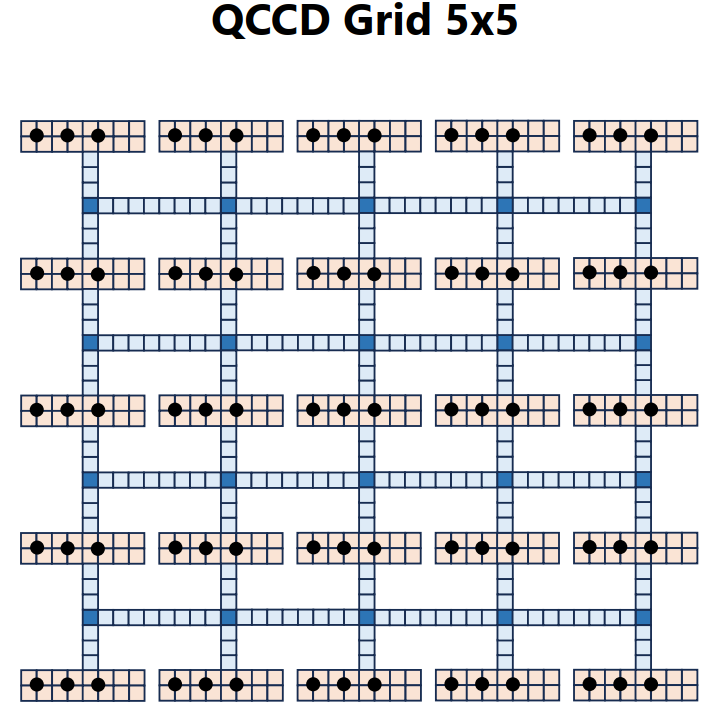
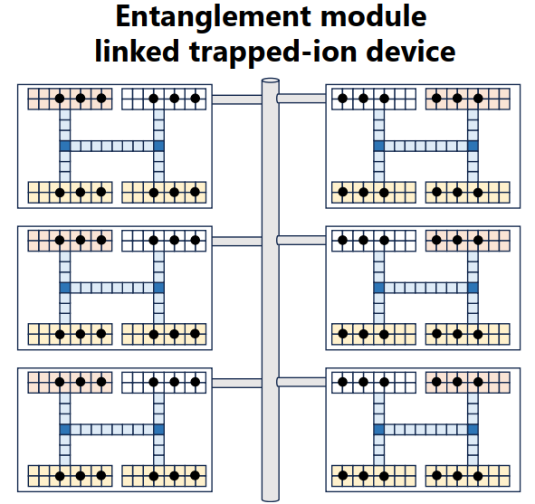
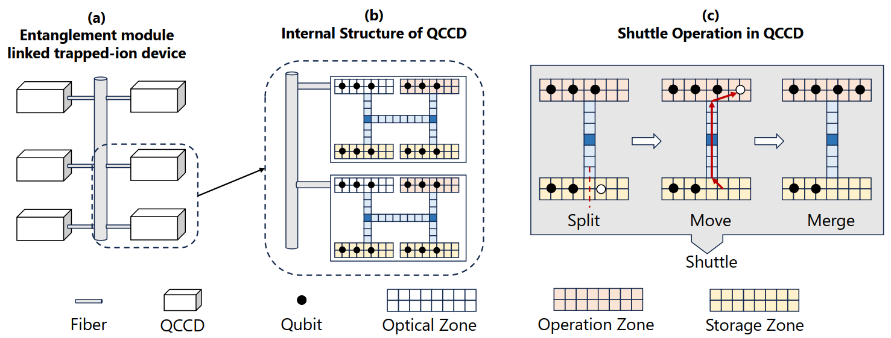
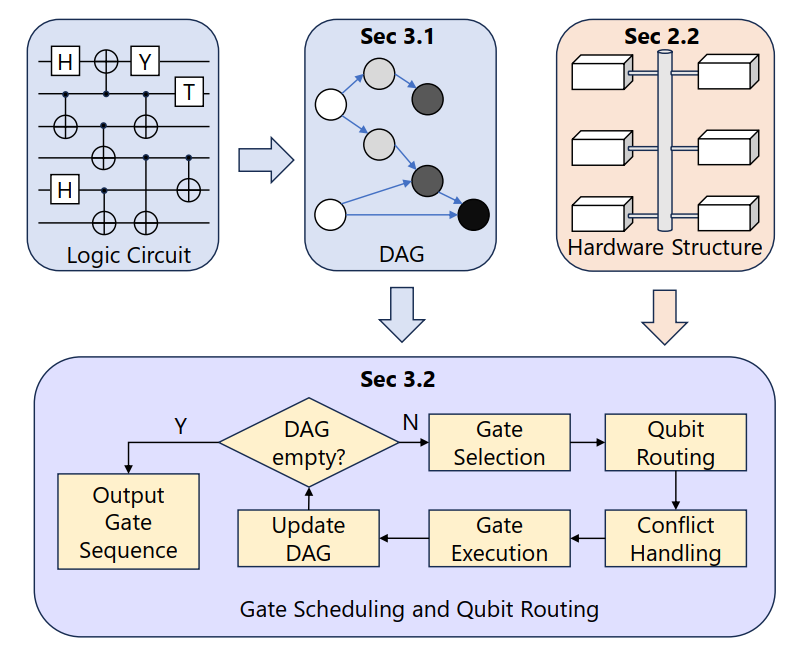
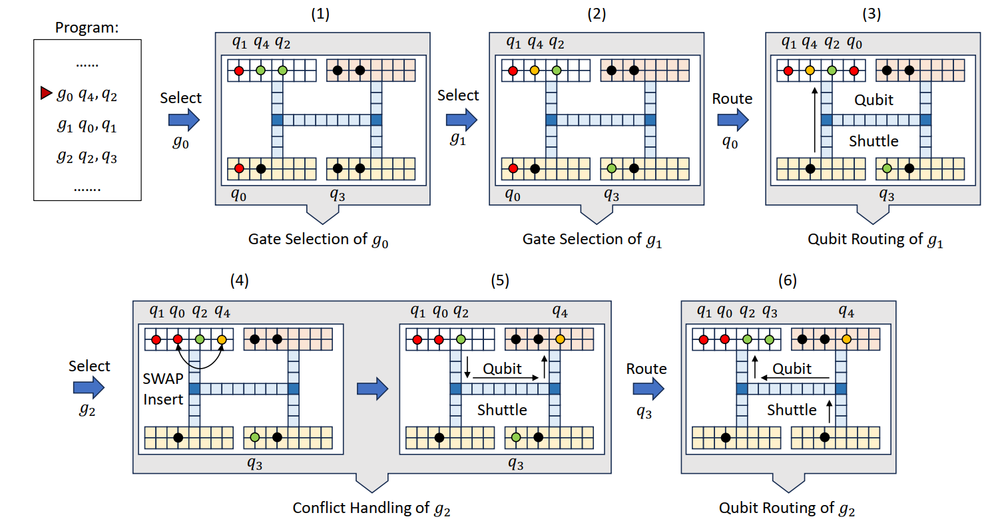
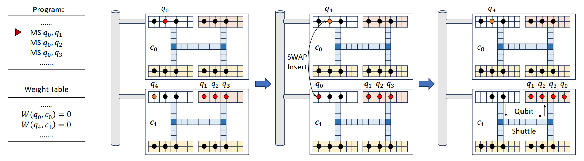

## 《MUSS-TI꞉ Multi-level Shuttle Scheduling for Large-Scale Entanglement Module Linked Trapped-Ion》 阅读笔记

### 前置知识

#### QCCD (Quantum Charge-Coupled Device)，量子电荷耦合器架构

有兴趣可以先了解 QCCD 的灵感来源，相机的 CCD：

- 先看这个【秒懂 CCD 原理】https://www.bilibili.com/video/BV1QM4m1U7DU
- 再看这个（RGB 图像）【CCD 工作原理】https://www.bilibili.com/video/BV1LD421L75o
- 每一组电荷包代表灰度信息，在 RGB 图像中，红像素的电荷表示红色亮度，绿像素的电荷表示绿色亮度，蓝像素的电荷表示蓝色亮度。

QCCD 的架构示例：

黑点代表离子，每个 trap（存储区）中都有若干个离子，trap 的作用是固定离子，稳定离子的状态。（每个 trap 相当于包含一个 "BOSS" 论文中提到的离子条带）

QCCD 架构对 trap 中的离子可以做以下操作：

- 囚禁与存储：在某一段电极上形成势阱，把 1–几颗离子稳定关在本 trap 中，作为：
  - memory zone：长期存储离子信息、尽量不打激光；
  - 或 interaction zone：准备做门的工作区。
- 传输：包括 shuttling / split / merge / 重排 操作
  - 传输：可以将一个 trap 中的离子条带运输到蓝色区域，然后再移动到另一个 trap 中。
  - 分裂 / 合并离子链（split / merge）：可以把原来一个 trap 中的一条离子条带分裂成两个离子条带，也可以将两个离子条带合并成一个离子条带。
  - 重排：可以直接在同一个 trap 区域里调换离子顺序（通过 split + merge）
- 量子门操作：
  - 单比特门：如果该 trap 上方有局域激光，可以直接进行旋转门操作；否则，先把目标离子 shuttle 到门区（图中蓝色区域），再对它做单比特门。
  - 多比特门：把需要纠缠的离子从各自的 trap 中 shuttle 到门区（图中蓝色区域），然后再对它们做多比特门。

#### EML-QCCD (Entanglement Module Linked QCCD)

整体架构：

从图中可以看到，EML-QCCD 由多个 QCCD 组成，通过中间那根杆连起来，这根杆通过 光纤 + 光学接口，能够对不同 QCCD 中的离子进行远程纠缠。

EML-QCCD 中的每个 QCCD 的 trap 可以划分为 3 中区 (Zone)：

- Storage zone（黄色）：只存离子，不作用门；
- Operation zone（红色）：可以对 trap 内的离子进行两比特门操作；
- Optical zone（白色）：这块同时接了光纤，可以和别的 QCCD 的 optical zone 做纠缠门；zone 内部离子之间也能做两比特门。

论文采用多级调度的算法，类型传统计算机架构中的 “CPU 寄存器 - cache 缓存 - 内存” 的层级，论文中称 Optical zone（白色）为 level 2（最高级），Operation zone（红色）为 level 1，Storage zone（黄色）为 level 0。

### MUSS-TI 算法

#### 算法概述

MUSS-TI 算法总体来说的作用是：在这种 EML-QCCD 上，把一个逻辑量子电路编译成“具体在哪个 trap 打什么门、哪一步 shuttle 哪个离子”的序列，让 shuttle 次数尽量少、执行时间短、整体 fidelity 高。

接下来照着上面这个流程图把 MUSS-TI 算法将一遍：

1. 算法的第一步依然是构造依赖图，和 "BOSS" 中一样。
2. 挑选门 (Gate Selection)，遍历 DAG 所有入度为 0 的门，如果满足硬件约束，就直接作用。当没有 gate 满足时，用 “first-come, first-served”（按出现顺序）选一个门来调度。
3. 比特调度 (Qubit Routing)，当要执行某个 gate 但 qubit 不在合适的位置时：在所有可行的候选 zone 中，一般优先选 level 高的区域搬入离子，搬出也是同理，优先选 level 高的；
4. 冲突处理 (Conflict Handling)：当前 zone 需要搬入一个比特，但是 zone 已经满了，就使用 LRU 调度，将最久未使用（LRU）的比特搬出；但是 shuttle 只能在离子链边缘 split / move / merge，所以要写执行 SWAP 门，将要搬出的比特交换到边缘。

论文举了个例子，加深下理解：

#### SWAP 门插入技巧

1. 建一个 **权重表 $W(q_i,c_j)$**：在接下来的 (k) 层 DAG 里，qubit $q_i$ 需要和 QCCD $c_j$ 上的 qubit 做两比特门的次数。
2. 每当刚执行完一个跨 QCCD 的门，比如 gate 用到了 $q_a$（在 module $c_a$）和 $q_b$（在 $c_b$），就将权重表对应的项减一。
   * 若 $W(q_a, c_a)=0$，说明 $q_a$ 在这个模块后面没用了；
   * 再看看是否存在另一个模块 $c_j$，使得 $W(q_a,c_j) > T$（未来在那边要用很多次）；
     同时在 $c_j$ 上恰好有一个 qubit $q_c$，满足 $W(q_c,c_j)=0$（它在自己的模块已经没用了）。
   * 若条件都满足，就插入 **SWAP($q_a,q_c$)** 把两个 qubit 对换模块。
   * 这样下一段时间里，所有涉及 $q_a$ 的门都可以在“更靠近”的地方跑，shuttle 少很多。

论文举了个例子，加深下理解：

这个例子中，将 Optical zone 中的离子移动到 Operation zone，似乎违背了前面 Qubit Routing 的理论，但我猜论文的意思可能是，再 shuttling 次数相同的情况下，才优先选择 Optical zone。

#### qbuit-trap 映射初始化

初始 qubit–trap 映射对表现影响很大，论文提出了两种：

1. **平凡映射**：按 qubit 编号顺序，从高级别 zone（optical → operation → storage）依次往里面塞；

1. **SABRE-style 双向搜索 mapping**：

   * 先用 trivial 映射跑一遍 DAG → 得到终态映射 $\pi'$；
   * 用 $\pi'$ 作为初始映射跑“反向电路” $\mathcal{G}'$（把依赖反过来）→ 得到 $\pi''$；
   * 再用 $\pi''$ 作为真正编译的初始映射。
   * 这就像先“来回跑一遍”，把将来会常用的 qubit 自动“预热”到重要 zone。
(为什么？我不理解，这里可能需要讨论一下)

实验里也做了消融：

* 只有 trivial → fidelity 最差；
* 加 SABRE 映射 → fidelity 明显提升；
* SABRE + SWAP insert 组合 → 效果最好。
