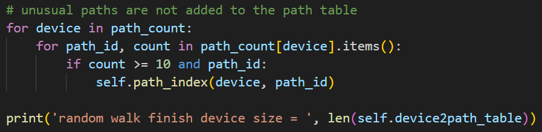
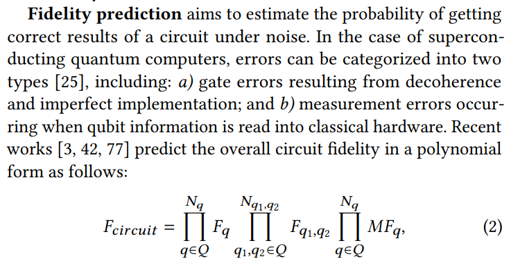
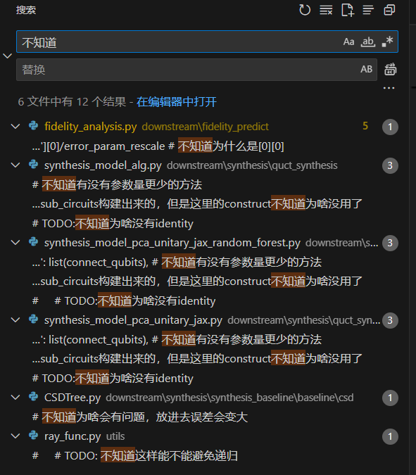

## QuCT꞉ A Framework for Analyzing Quantum Circuit by Extracting Contextual and Topological Features 阅读笔记

论文核心思想：将量子门进行向量化表示，从而定量描述该门与相邻门之间相互作用的程度。

QuCT 框架包含一个上游模型和若干个下游模型。上游模型将量子门进行向量化，下游模型可以实现具体的功能，例如：电路保真度预测，量子门电路分解。

### 上游模型

使用电路数据集，在电路上随机游走，生成各个量子门对应的路径表。（算法中，CNOT(0,1)和CNOT(1,2)是两个不同的量子门）

代码中，只取出现次数大于 10 的路径加入路径表（不添加不常见的路径）

这样，对于一个量子电路的输入，上游模型可以将每个量子门转换成向量，向量的长度等于路径表的长度。

但是不同门的路径表大小可能是不同的，代码将向量长度统一为最长的路径表长度，不足的部分补 0。

同时，代码还构建了 电路-向量 的双向映射。

### 下游模型

#### 保真度

量子线路要在真机上运行，首先得分解成基本门，然后由于部分真机存在拓扑结构，需要使用 SWAP 门来辅助实现拓扑结构下的CNOT门。QuCT 能够引导编译过程，选择出保真度最高的输出电路。然后进行调度优化，指对门层进行调整，以在满足执行依赖关系的前提下进一步提升保真度。（例如某些门可以在不同层之间移动，移动后的保真度可能会改变，算法能够优先选择保真度高的）

首先还是要有数据集。比如要预测某一台真机上的电路的保真度，那么就要从这台真机上获取 电路-保真度 的数据集。上游模型中我们将电路转换成了等长度的向量，下游模型中我们构建 向量-保真度 的模型，使用机器学习算法训练模型。

这样，对于一个新的电路就可以直接算出保真度。

#### 量子门分解

该方法基于 QFAST 算法，论文中说 QFAST 采用 “A\*递归算法”，但是我去看了 QFAST 原论文和代码，似乎没有用到 A\* 算法，而是使用梯度下降的方法。前面提到训练了模型，能够将电路转换成向量。这里使用随机森林的模型进行训练，构建 酉矩阵-向量 的映射模型（还是需要数据集）。

使用 QFAST 过程中，将目标矩阵转换成向量，然后根据 电路-向量 的双向映射表，转换成电路。然后计算电路的酉矩阵，然后重新计算距离函数，判断是否需要进一步迭代。

### 关于保真度的说明

保真度一般是对于量子态来说的，对于量子门来说时，可能指对于所有的量子态输出，输出结果的正确性。

量子态的保真度使用密度矩阵来求，为什么不直接使用两个量子态的点积？因为量子态可能是混合态，例如50%是 |0>，50%是 |1>，这个时候就无法使用点积来衡量保真度。

量子门保真度有两种，量子信息论中的保真度和工程仿真中的保真度。论文中提到的是工程仿真中的保真度。

+ 量子信息论中的保真度：电路输出结果和理论结果的相似程度
+ 工程仿真中的保真度：电路有多少概率输出正确结果

举个例子。现在有一个 $X$ 门，90% 使态完全反转，10% 会变成其他态（不一定什么都不做），那么在工程仿真中，保真度就是 90%。但是在量子信息论中，可能略高于 90%，当剩下 10% 的概率越接近于正确的态时，量子信息论中的保真度也会越高。

因此论文中的这个公式

从概率论的角度粗略估算了保真度。

### 关于论文使用模拟器仿真做实验的说明

另外，论文使用了模拟器来实验验证 QuCT 的可靠性。使用 RX 门（角度范围为[-π/20, π/20]）来模拟两个量子门之间的串扰。

### 对代码的质疑

怎么这么多“不知道”，这代码真的靠谱吗？QAQ

