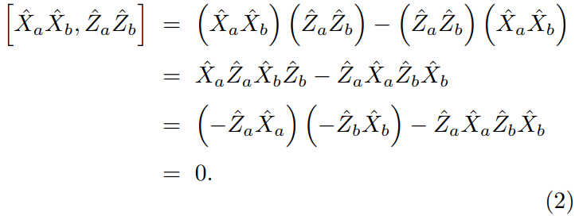
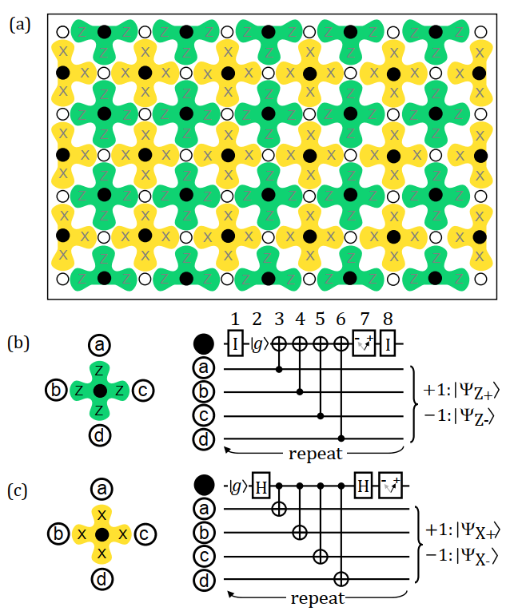
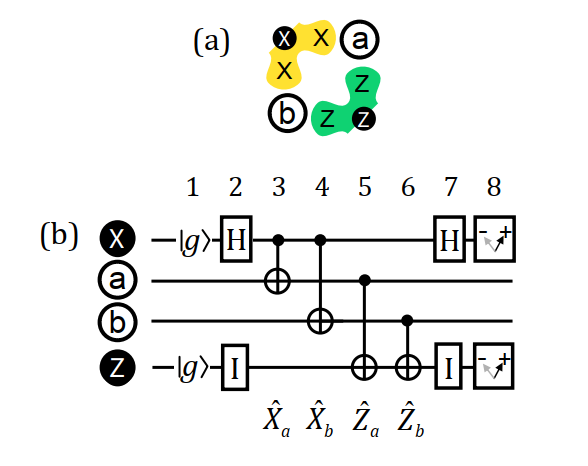

## Surface codes: Towards practical large-scale quantum computation 阅读笔记

参考论文 https://arxiv.org/abs/1208.0928

### 前置知识

首先明确测量的概念：

- $Z$ 测量：在物理量子比特上作用 $Z$ 门，由于 $Z \ket{0} = \ket{0}$ 和 $Z \ket{1} = -\ket{1}$，则 $\ket{0}$ 是 $Z$ 本征态，$\ket{1}$ 是 $Z$ 激发态。我们说 $\ket{0}$ 进行 $Z$ 测量得到 $+1$，$\ket{1}$ 进行 $Z$ 测量得到 $-1$。
- $X$ 测量：在物理量子比特上作用 $X$ 门，由于 $X \ket{+} = \ket{+}$ 和 $X \ket{-} = -\ket{-}$，则 $\ket{+}$ 是 $X$ 本征态，$\ket{-}$ 是 $X$ 激发态。我们说 $\ket{+}$ 进行 $X$ 测量得到 $+1$，$\ket{-}$ 进行 $X$ 测量得到 $-1$。

测量可以理解为将量子比特在某一方向进行投影。

考虑两个量子一起测量的情况，可以同时进行 $X$ 测量，也可以同时进行 $Z$ 测量，在两个量子比特的情况下，这两个测量是可以交换顺序的（对易）。

补充关于对易：

例如，矩阵乘法通常是不能交换顺序的，如 $AB - BA \neq \bm{0}$

但是双量子比特算子 $X_aX_b$ 和 $Z_aZ_b$ 是对易的：

这意味着一个两比特态实际上可以同时是 $X_aX_b$ 和 $Z_aZ_b$ 的本征态。

测量结果和对应的态关系列表：

| $Z_aZ_b$ | $X_aX_b$ | $\ket{\psi}$ |
|--|--|--|
|$+1$|$+1$|$\frac{1}{\sqrt{2}}(\ket{00}+\ket{11})$|
|$+1$|$-1$|$\frac{1}{\sqrt{2}}(\ket{00}-\ket{11})$|
|$-1$|$+1$|$\frac{1}{\sqrt{2}}(\ket{01}+\ket{10})$|
|$-1$|$-1$|$\frac{1}{\sqrt{2}}(\ket{01}-\ket{10})$|

可以发现，表中的 $\ket{\psi}$ 进行测量后，状态不会改变，只会改变相位的正负。这种情况下的 $Z_aZ_b$ 和 $X_aX_b$ 被称为稳定子。

如果态发生了 $X$ 错误，原本是 $\frac{1}{\sqrt{2}}(\ket{00}+\ket{11})$，测量结果为 $(+1,+1)$，第一个或第二个量子比特反转都会将态变成 $\frac{1}{\sqrt{2}}(\ket{01}+\ket{10})$，测量结果为 $(-1,+1)$。

如果态发生了 $Z$ 错误，原本是 $\frac{1}{\sqrt{2}}(\ket{00}+\ket{11})$，测量结果为 $(+1,+1)$，第一个或第二个量子比特出现 $Z$ 错误都会将态变成 $\frac{1}{\sqrt{2}}(\ket{00}-\ket{11})$，测量结果为 $(+1,-1)$。

通过上面这个例子，我们知道如何从测量结果中看出是什么类型的错误，但是无法知道是哪个比特出现了错误。

### 表面码

### 二比特表面码的例子

了解了二比特表面码的例子，就可以推广到多比特的情况。

图中，a 和 b 是数据比特，X 是 X 测量比特，Z 是 Z 测量比特。

现在一步一步推导。

#### 第一步

假设现在量子 $a$ 和 $b$ 状态为（先忽略归一化）：

$\ket{\psi_{ab}} = A\ket{00}+B\ket{01}+C\ket{10}+D\ket{11}$

整体线路状态为：

$\ket{\psi_{1}}=A\ket{0000}+B\ket{0010}+C\ket{0100}+D\ket{0110}$

#### 第二步

X 测量比特作用 H 门后：

$\ket{\psi_{2}}=A\ket{+000}+B\ket{+010}+C\ket{+100}+D\ket{+110}$

即（忽略归一化）

$\ket{\psi_{2}}=A\ket{0000}+A\ket{1000} \\ +B\ket{0010}+B\ket{1010} \\ +C\ket{0100}+C\ket{1100} \\ +D\ket{0110}+D\ket{1110}$

#### 第三步

作用第一个 CNOT 门：

$\ket{\psi_{3}}=A\ket{0000}+A\ket{1100} \\ +B\ket{0010}+B\ket{1110} \\ +C\ket{0100}+C\ket{1000} \\ +D\ket{0110}+D\ket{1010}$

#### 第四步

作用第二个 CNOT 门：

$\ket{\psi_{4}}=A\ket{0000}+A\ket{1110} \\ +B\ket{0010}+B\ket{1100} \\ +C\ket{0100}+C\ket{1010} \\ +D\ket{0110}+D\ket{1000}$

#### 第五步

作用第三个 CNOT 门：

$\ket{\psi_{5}}=A\ket{0000}+A\ket{1111} \\ +B\ket{0010}+B\ket{1101} \\ +C\ket{0101}+C\ket{1010} \\ +D\ket{0111}+D\ket{1000}$

#### 第六步

作用第四个 CNOT 门：

$\ket{\psi_{6}}=A\ket{0000}+A\ket{1110} \\ +B\ket{0011}+B\ket{1101} \\ +C\ket{0101}+C\ket{1011} \\ +D\ket{0110}+D\ket{1000}$

#### 第七步

X 测量比特作用 H 门：

$\ket{\psi_{7}}=A\ket{+000}+A\ket{-110} \\ +B\ket{+011}+B\ket{-101} \\ +C\ket{+101}+C\ket{-011} \\ +D\ket{+110}+D\ket{-000}$

即：